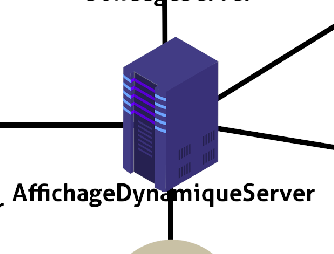

Les différents serveurs 
=======================

Pour bien fonctionner, on a crée 3 serveurs qui communique ensemble, 
:ref:`le serveur gérant l'affichage et sa gestion <affichagedynamique>`, 
:ref:`un serveur qui s'occupe de faire le lien entre Pronote et le premier 
serveur <pronoteserver>` et le dernier :ref:`serveur qui s'occupe de faire 
le lien entre les élèves et le serveur principal pour les sondages <serveursondage>`.

.. _affichagedynamique:

Gestion de l'affichage dynamique
--------------------------------

Le serveur est entièrement fait en python grâce au framework Django. Il se lance
sur le port ``8000`` de la machine. Il est découpé en 3 applications : 
    
    * :ref:`Affichage`
    * :ref:`WebServer`
    * :ref:`ApiServer`

.. _Affichage:

Affichage 
_________

L'application ``Affichage`` est assez simple, elle s'occupe de renvoyer les pages ``HTML`` correspondante à l'identifiant d'un l'écran fourni. 

Par exemple, lorsque l'on fait une requête ``GET`` vers :

.. code-block:: text

    localhost/ecran?name=self

Elle nous renverra le fichier ``HTML`` correspondant au paramètre ``ecran``, qui est ``self``, à afficher.

Si l'application ne trouve pas de page correspondante, elle renverra un fichier ``HTML`` ``base`` qui nous sert à ne pas laisser un écran noir en plein milieu du lycée s'il y a une maintenance.

Références des fonctions et des vues: :doc:`ici <generated/AffichageDynamiqueServer/Affichage>`

.. _WebServer:

WebServer
_________

L'application ``WebServer`` gère toutes les pages de gestion des écrans. Par exemple, 
celle pour ajouter un article ou celle pour ajouter des informations à la BDD

Références des fonctions et des vues: :doc:`ici <generated/AffichageDynamiqueServer/WebServer>`

.. _ApiServer:

ApiServer
_________

L'application ``ApiServer`` quant à elle s'occuper de gérer et de retourner les données 
demandées sous format ``JSON``. Les données concernent uniquement les écrans, c'est à dire 
que les requêtes atteignant cette application proviennent uniquement des écrans.

Documentation de l'api : :doc:`ici <api>`

.. _pronoteserver:

PronoteServer
-------------

Le serveur est entièrement fait en ``nodeJS`` avec le module `pronote-api <https://github.com/dorian-eydoux/pronote-api>`_ . 
Le module étant seulement en ``nodeJS`` nous avons préféré faire un serveur secondaire qui fera le lien 
entre pronote et le serveur :ref:`Affichage dynamique<affichagedynamique>`. Ce serveur n'est disponible seulement en 
local pour des raisons de sécurités.

Le serveur se connecte à pronote avec des identifiants donnés, garde une session
n'ayant pas de limite dans le temps et fait des requêtes vers Pronote quand on demande 
une ressource provenant de Pronote, pour être sûr d'être à jour. Si jamais il y a un 
problème avec le serveur ``nodeJS`` , chaque resultat de requête est sauvegardé dans la base 
de données pour permettre de quand même retourner une valeur.

Pour le moment le serveur récupère seulement les profs absents et les menus de la date 
demandée (si la date n'est pas précisée, par defaut ça sera la date d'aujourd'hui qui 
sera utilisée)

Le serveur tourne sur le port ``5000`` en ``http``.

Documentation de l'api : :doc:`ici<pronoteServerApi>`

.. _serveursondage:

Serveur sondage
---------------

Le serveur sondage est entièrement consacré à faire le lien entre les élèves et
le :ref:`serveur AffichageDynamique <affichagedynamique>`.Il sert d'intermédiaire.

Il est programmé en ``Python (Django)`` et il se lance sur le port ``8080`` de la machine.

Il a une vue pour le choix du vote, et les autres qui ne sont que là pour connaitre le status
de l'envoie du vote.

Documentation du serveur : :py:mod:`ici<votes.views>`.