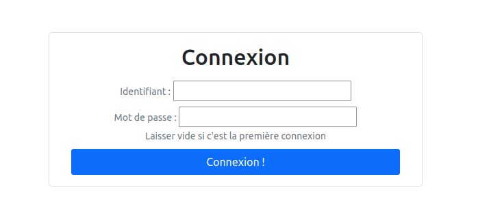
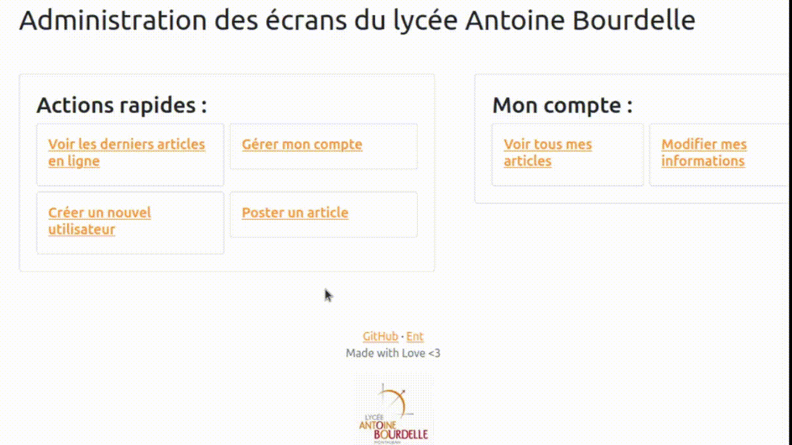
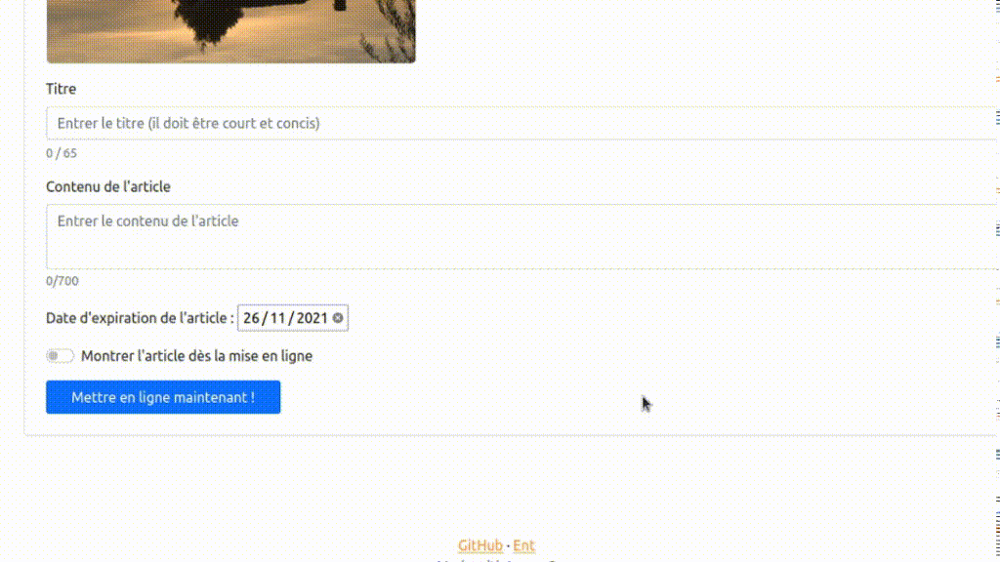
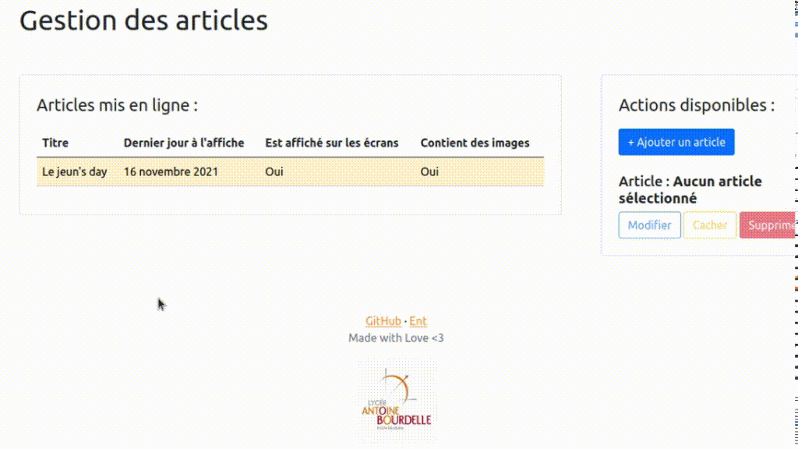
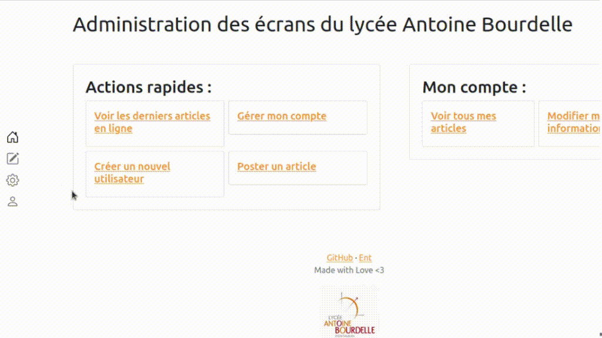
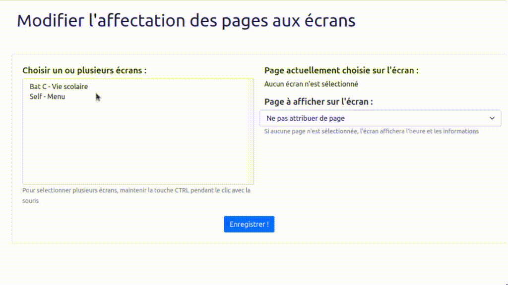
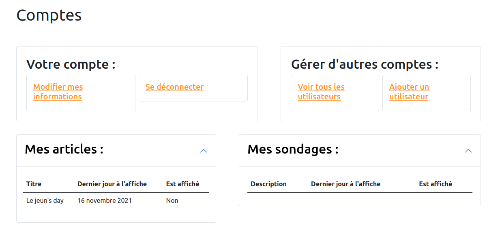
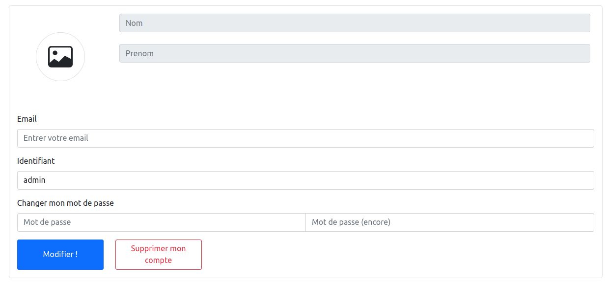

# Utilisation de l'interface de gestion des écrans
Dans ce document vous verrez quelles sont les différentes fonctionnalités disponibles et comment les utiliser pour avoir la meilleure maîtrise de l'outil

Ce document se découpe en 7 parties :
- [La connexion au compte](#la-connexion-au-compte)
- [Les articles](#les-articles)
- [Les informations (ou annonces)](#les-informations)
- [La gestion individuelle d'un écran](#gestion-individuelle-dun-écran)
- [La gestion de son compte](#gérer-mon-compte)
- [La gestion des utilisateurs](#gérer-les-utilisateurs) 
- Les sondages (Bientôt)

## La connexion au compte

La première étape pour accéder au site internet est de se connecter. Pour si connecter, c'est aussi simple que bonjour, il faut utiliser les mêmes identifiants que votre session sur les ordinateurs du lycée et c'est tout. 

## Les articles
### Créer un article
Si vous avez les permissions necéssaires, vous pourrez accéder à la page de création d'un article : 

Une fois sur cette page, vous pouvez y ajouter plusieurs informations :
#### Une image
Vous pouvez ajouter n'importe quelle image à l'article mais attention, si elle ne correspond pas au format 16:9, elle sera automatique redimensionnée sauf si vous decidez de la modifier.

Si vous cliquez une nouvelle fois sur l'image une fênetre apparaîtra et vous permettra de modifier l'image que vous avez choisis. 

Tout ce qui se trouve dans le cardre blanc sera affiché sur l'image finale, vous pouvez le deplacer, le redimensionner et même le faire tourner avec les boutons dans la barre d'outils juste au dessus.

Si l'image ne vous plaît pas vous pouvez toujours la changer ou la supprimer avec le bouton rouge.

Une fois vos modifications finies, vous pouvez enregistrer l'image et vous verrez dans le cadre la nouvelle image fraichement modifiée.

#### Un titre
Le titre sera affiché en gros sur les écrans. Vous avez 65 caractères maximum pour le créer, choisissez un titre court et compréhensible !

#### Une description
La description sera le texte affiché juste à côté de l'image et du titre, vous avez une marge de 750 caractères ce qui est plus que suffisant pour la majorité des textes.

#### Une date de péremption 
Et oui même les articles ne sont pas éternels ! Si votre article parle d'un événement ponctuelle alors il n'est pas nécessaire de le laisser afficher après la date de l'événement. Donc dans cette case vous pouvez mettre la date de l'événement, l'article restera affiché jusqu'au soir à minuit de cette date.

Par defaut, l'article restera une semaine en ligne.


#### Afficher avec la mise en ligne 
Si cette option est décochée alors quand vous cliquerez sur mettre en ligne, l'article sera sauvegardé dans le serveur mais ne sera pas encore affiché sur les écrans.

Alors que si cette option est cochée, alors de que vous cliquerez sur mettre en ligne, l'article se sauvegardera sur le serveur et s'affichera automatiquement sur les écrans après un court laps de temps.

#### Exemple 
Voici un article complet sur la page de mise en ligne :
```
Image d'un article type sur la page de création
```
Et ici le même article sur les écrans une fois postée :
```
Image d'un article type sur l'écran de la vie scolaire
```

### Gérer les articles
Depuis l'interface de gestion des articles, plusieurs options s'offrent à vous :
#### Cacher / Afficher un article 

L'option surement la plus utile, grâce à elle vous pouvez cacher un article actuellement affiché sur les écrans sans pour autant le supprimer définitivement du serveur. On préfera cacher un article plutôt que de la supprimer entièrement du serveur.

Si vous recliquer sur le bouton vous pourrez afficher un article qui n'est pas encore affiché sur les écrans, c'est aussi simple que ça.

#### Modifier un article
Une fois l'article sélectionné, vous pourrez le modifier et les modifications s'appliqueront comme si c'était un nouvel [article](#les-articles).

#### Supprimer un article 
Cette option supprimera l'article de la base de données, cette action sera IRREVERSIBLE. On préfera utiliser l'option [cacher l'article](#cacher--afficher-un-article).

## Les informations
Les informations ou plus communément appelé annonces sont des textes courts qui seront affichés en bas des écrans et qui défileront tout le long de la journée. Il y a différents niveaux d'importance d'information, les informations "lambdas" ou les informations "importantes". Selon le niveau choisi, l'affichage adaptera le texte pour qu'il y corresponde.
``` 
Gif montrant une information sur un des écrans
```
### Créer une information 

#### Le contenu
Le texte sera ce qui sera affiché sur les écrans
#### Le type
Le type de l'information c'est son niveau d'importance, si l'information est lambda ou si elle est importante
#### La date de péremption 
[Identique à Une date de péremption](#une-date-de-péremption)

#### Montrer l'information une fois mise en ligne
[Identique à Afficher avec la mise en ligne](#afficher-avec-la-mise-en-ligne)

### Gerer les informations 
[Identique à Gerer les articles](#gérer-les-articles)
## Gestion individuelle d'un écran
L'entièreté du projet a été développé dans l'optique d'avoir une gestion différenciée des écrans le plus simple possible, voici comment l'utiliser :

A droite, on voit la liste de tous les écrans installés et opérationnels au lycée.

A gauche, une fois qu'un (ou plusieurs) écran est sélectionné, on voit quelle page est actuellement affichée (par exemple la page contenant le menu du self) et on voit aussi un menu déroulant.

Ce menu permet de changer la page affiché, donc par exemple remplacer la page "menu du self" affiché sur un écran par la page "articles et profs absents".

Une fois les changements appliqués, les écrans se mettront automatiquement à jour au bout de maximum 2 minutes.

## Gérer mon compte
Sur cette page vous trouverz vos [articles](#les-articles), vos sondages, le bouton de déconnection, le bouton pour [gérer d'autres comptes](#gérer-les-utilisateurs) et enfin le bouton pour changer vos propres informations.

Une fois sur la page de modification de votre compte vous pourrez changer :
- Votre pseudonyme (ce qui vous permez de vous connecter) (Modification prévues)
- Votre photo de profil ([Identique à Une image](#une-image))
- Votre adresse mail 

Et supprimer votre compte (une fois validé, le compte sera désactivé mais pas complétement supprimé, ses informations seront toujours visible par un membre autorisé).


## Gérer les utilisateurs
Pour gérer les utilisateurs, c'est la page qu'il vous faut !

A droite, nous avons une liste d'utilisateur ayant accès au site de gestion et à gauche nous avons les actions possibles sur le compte sélectionné.

### Désactiver / Activer
Le bouton désactiver / activer permet d'empêcher (ou d'autoriser) la connexion d'un utilisateur au site internet. Cette action n'a aucune autre fonction que cela, elle permet de ne pas supprimer toutes les informations d'un utiliseur tout en lui interdisant de se connecter.

### Voir le compte
Sur cette page vous pouvez voir les informations relative au compte sélectionné et si vous avez les permissions suffisantes, vous pouvez même modifier ses informations, reinitialiser son mot de passe au cas où il l'a perdu, et supprimer son compte(On préfèrera utiliser [Désactiver / Activer](#désactiver--activer)).

## Les sondages
### Ajouter un sondage
```
Image de l'ajout de sondage
```
Pour ajouter un sondage, il faut d'abord choisir une question à laquelle les gens vont devoir répondre par des réponses préchoisies.

La question peut être par exemple : `Au foyer, préférez vous un baby foot ou une table de ping pong ?`

A cette réponse vous pouvez répondre par `OUI` ou par `NON`. Pour rendre cela possible, il faut crée les réponses.

Il faudra taper dans la zone correpondante le texte de la réponse et appuyer sur `Ajouter`.

Pour la date de péremption, c'est identique à [Une date de péremption](#une-date-de-péremption)

Pour l'afficher dès la mise en ligne, c'est identique à [Afficher avec la mise en ligne](#afficher-avec-la-mise-en-ligne)

### Modifier un sondage
Identique à [Ajouter un sondage](#ajouter-un-sondage)

### Gérer les sondages
Identique à [Gérer les articles](#gérer-les-articles)

### Voir les résultas
```
Image de l'affichage des resultats d'un sondage
```
Pour voir les resultats, il faut sélectionner le sondage et appuyer sur `Voir les résultats`.

Une fois fait, on voit un donut apparaître avec les différentes couleurs représentants les différentes réponses possibles au sondage. (Les couleurs sont aléatoires)

Sur la droite, on voit le nom du sondage, sur quelle periode il a été fait, le nombre de vote par réponse et le nombre de vote total.